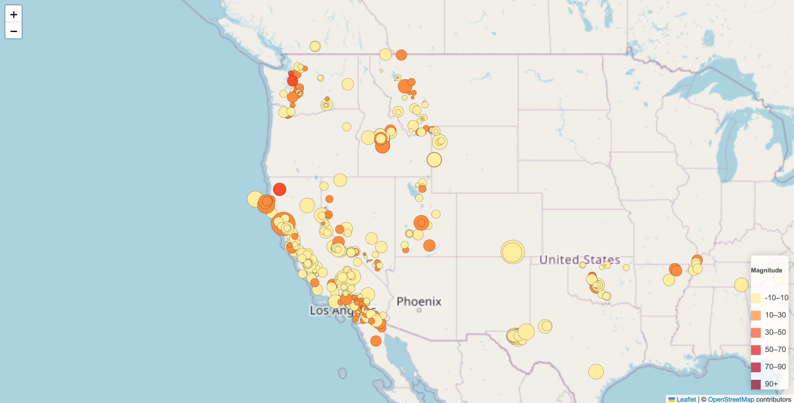
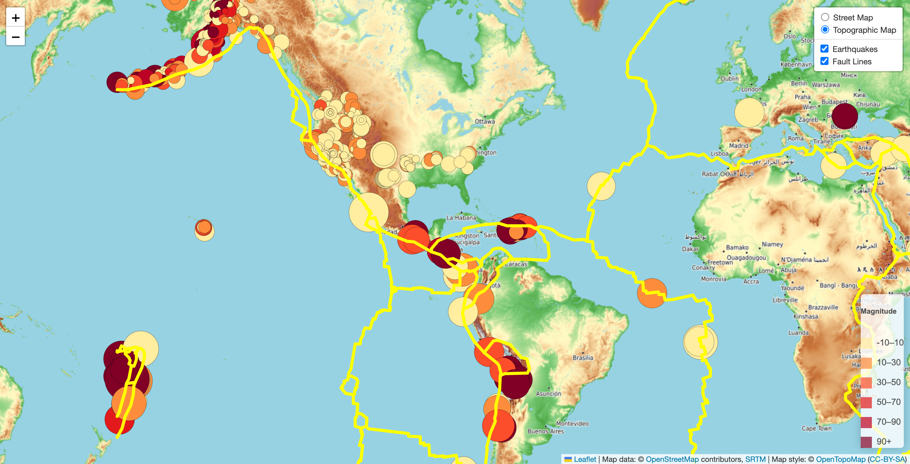

# leaflet-challenge

Leaflet-Part-1 file: code of Part 1

Leaflet-Part-2 file: code of Part 2

### Part 1: Create the Earthquake Visualization

##### 1.Dataset.

[USGS GeoJSON Feed](http://earthquake.usgs.gov/earthquakes/feed/v1.0/geojson.php) -"All Earthquakes from the Past 7 Days"

[Click here to preview the JSON format of dataset](https://earthquake.usgs.gov/earthquakes/feed/v1.0/summary/all_week.geojson)

##### 2.Import and visualize the data by doing the following:

* Using Leaflet, create a map that plots all the earthquakes from dataset based on their longitude and latitude.
  * data markers reflect the magnitude of the earthquake by their size and the depth of the earthquake by color. Earthquakes with higher magnitudes appear larger, and earthquakes with greater depth appear darker in color.
* Include popups that provide additional information about the earthquake when its associated marker is clicked.
* A legend that will provide context for the map data.

##### 3.Preivew of the visualization

### Part 2: Plot the tectonic plates dataset on the map in addition to the earthquakes.

